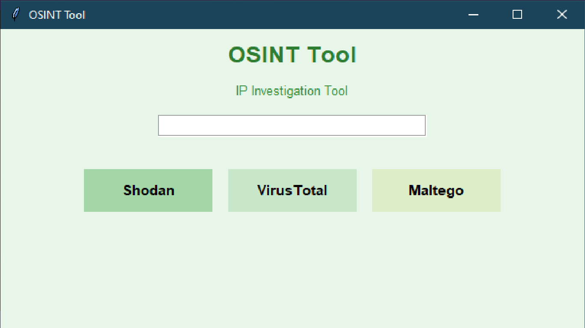

# 🌿 OSINT Tool (Green Edition)

Une application simple avec interface graphique (GUI) permettant d’analyser une adresse IP باستخدام des outils OSINT.

---

## 🧠 Description

Ce projet est une application développée en Python avec Tkinter.

Elle permet d’accéder rapidement à des plateformes OSINT pour analyser une adresse IP:

* 🌐 **Shodan** → informations sur les services exposés
* 🛡️ **VirusTotal** → réputation et sécurité de l’IP
* 🧩 **Maltego** → analyse avancée et relations

---

## 🖼️ Interface

Voici l’interface de l’application:



---

## 🚀 Installation et Exécution

### 1️⃣ Cloner le projet

```bash
git clone https://github.com/VOTRE_USERNAME/OSINT-IP-Analyzer.git
cd OSINT-IP-Analyzer
```

---

### 2️⃣ Installer les dépendances

```bash
pip install -r requirements.txt
```

---

### 3️⃣ Lancer l’application

```bash
python OSINT_Tool.py
```

---

## ⚙️ Utilisation

1. Entrer une adresse IP dans le champ
2. Cliquer sur un bouton:

* 🔎 **Shodan** → ouvre l’analyse dans Shodan
* 🛡 **VirusTotal** → vérifie la réputation
* 🌐 **Maltego** → ouvre le site officiel

---

## 🎥 Démonstration

👉 Voir la vidéo ici:

[📥 Télécharger la vidéo](Vidéo.rar)

---

## 📦 Technologies utilisées

* Python 3
* Tkinter (GUI)
* Webbrowser module

---

## 👨‍💻 Auteur

* VOTRE NOM

---

## ⚠️ Remarque

* Une connexion Internet est requise
* Ce projet est destiné à un usage éducatif uniquement
